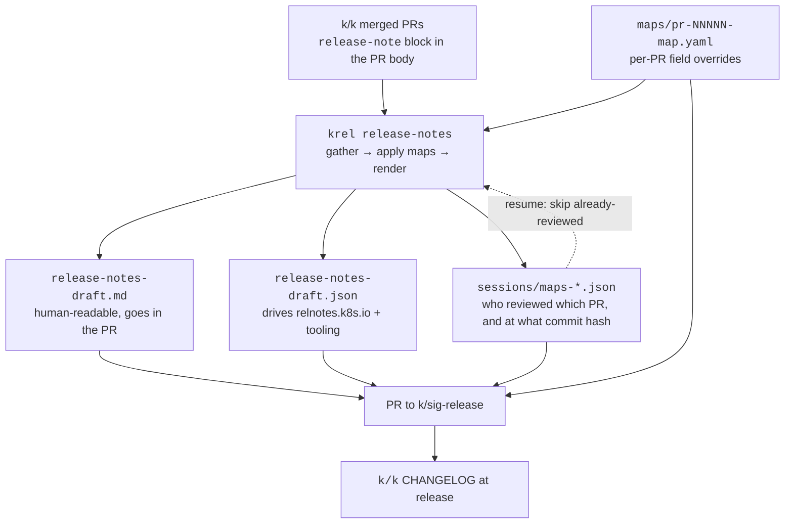

# Release notes generation — how it actually works

Written to answer the question the handbook doesn't: *why does this feel like a hassle, and what am
I actually manipulating?* Five labs at the end run against the real, shipped v1.37 data on this
machine. Do them before `alpha.1` on 23 Sep, because after that you're teaching it.

---

## 1. The one thing that makes it click

**`release-notes-draft.md` and `release-notes-draft.json` are generated artifacts. They are outputs,
not sources.**

Almost every confusion about this tool dissolves once that lands. The source of truth is two things:

1. the `release-note` block in each merged PR on `kubernetes/kubernetes`, and
2. the **map files** in `releases/release-1.XX/release-notes/maps/`.

`krel` reads both, applies the maps on top of the PR data, and regenerates the drafts from scratch.

Here's the proof, from v1.37. Commit [`0de7449c`](https://github.com/kubernetes/sig-release/commit/0de7449c) changed **four small map files** — a
handful of lines. The same commit shows:

```
maps/pr-139684-map.yaml       |    1 +
maps/pr-140357-map.yaml       |    3 +-
maps/pr-140651-map.yaml       |    2 +-
maps/pr-140697-map.yaml       |    2 +-
release-notes-draft.json      | 1522 ++++++-------
release-notes-draft.md        |  434 +++---
```

Four lines of intent produced roughly 1,500 lines of JSON churn and 430 of markdown. Nobody typed
those. That's regeneration.

### The consequence that bites

> **An edit you make directly to `.md` or `.json` is destroyed by the next regeneration.
> An edit you make in a map file survives.**

`rc.1` regenerates over `rc.0`. The final release regenerates over `rc.1`. So a hand-edit to the
draft at `rc.0` silently vanishes nine days later, and the reviewer who made it has no idea. That is
the mechanic behind the handbook's warning to "keep both files in sync" — but the deeper rule is
better: **fix it in the map.**

The exception is the very end. Once the final tag is cut there is no further regeneration, so the
Final Release Notes PR legitimately edits the drafts directly. And that's exactly what 1.37 did —
commit `c8a60c77` touched 7 map files *and* both drafts together. Before the last tag: maps only.

---

## 2. The pipeline



Everything in that diagram except the first box lives in `kubernetes/sig-release`, which is why the
release-notes PR always carries maps, sessions and both drafts together.

---

## 3. Anatomy of a map file

One file per PR, named `pr-<number>-map.yaml`. Any field you set **fully overrides** its PR
counterpart; anything you omit falls through to what GitHub reported.

```yaml
pr: 140357                    # required — the only mandatory field besides releasenote
releasenote:                  # required wrapper
  text: |-                    # the note itself. |- keeps newlines, strips the trailing one
    Updated the `kubectl explain` long description to fix formatting in the
    generated documentation and improve consistency with other commands.
  do_not_publish: false       # force a note INTO the draft — see the gotcha below
  sigs:                       # replaces the PR's SIG list entirely
  - cli
  kinds:                      # API Change / Feature / Bug or Regression / Deprecation / Other
  - documentation
  areas:                      # optional, finer-grained tags
  - kubectl
  author: someone             # rarely needed
  feature: false
  action_required: false
  release_version: 1.37.0
  documentation:              # optional linked docs
  - description: KEP
    url: https://...
pr_body: ""                   # krel writes this; blanking it keeps the file readable
```

**Multi-line text works** and is used heavily — the largest v1.37 map (`pr-139870-map.yaml`) is a
five-bullet markdown list inside one `text:` block, documenting every removed `cAdvisor` flag.
Don't fight the tool trying to compress a genuinely complex note into one sentence.

### The `do_not_publish` gotcha

Not mentioned anywhere in the Docs handbook, and 1.37 hit it. When a contributor's `release-note`
block in the PR body is malformed, the note gets **silently dropped** from the draft. Setting

```yaml
  do_not_publish: false
```

in a map forces it back in. Tushar's commit message for `0de7449c` says exactly this: *"Explicitly
sets `do_not_publish` to false for pull requests where the original release-note block was mangled,
ensuring they are included in the `.md` draft."*

So a note missing from the draft is not necessarily a note that doesn't exist. If you know a PR
should have a note and can't find it, that's the first thing to check.

The reverse, `do_not_publish: true`, hides a note. v1.38 alpha.1 used it for a same-version Go update
filed twice, and for two pairs of `resource.Quantity` PRs where a later PR undid the earlier one
within the cycle, so users see no change. The map still needs `text`, and the PR description should
say why each note is hidden.

---

## 4. Where the state lives

```
releases/release-1.38/release-notes/
├── maps/                       # your edits. 350 files by the end of 1.37.
│   └── pr-140357-map.yaml
├── sessions/                   # review state. 5 files in 1.37 — one per --fix session.
│   └── maps-1781290561.json
├── release-notes-draft.md      # generated. 124 KB in 1.37.
└── release-notes-draft.json    # generated. 392 KB in 1.37.
```

A session file is small and readable:

```json
{
  "mail": "<the git email of whoever ran it>",
  "name": "<their git name>",
  "date": 1781290561,
  "prs": [ { "nr": 137116, "hash": "bec86a4b0aa4eb..." }, ... ]
}
```

That `hash` is the mechanic behind two behaviours worth knowing:

- **Resume.** Answer `y` to "continue from the last session?" and krel skips every PR already in a
  session file. This is why the rotation works — each person only reviews what arrived since the
  last run.
- **Change detection.** If an author or admin edits the `release-note` block after you reviewed it,
  the hash no longer matches, and krel re-presents the note flagged *"✨ Note contents are modified
  with a map"*. You don't have to police edits manually.

Sessions are per-person and get committed. That's deliberate — it's the audit trail of who reviewed
what.

---

## 5. The commands you actually need

Set the token once per shell. `gh` is already authenticated here, so:

```bash
export GITHUB_TOKEN=$(gh auth token)
export PATH=$PATH:$(go env GOPATH)/bin
```

### `--repo`: use a clean worktree

**You can run krel from any directory.** It reads `k/k` from `--repo` (default `$TMPDIR/k8s`) and
clones `k/sig-release` to its own temp dir, pushes the branch to your fork, and deletes it. There's
no flag to relocate the sig-release clone.

The default location is fragile. v1.38 alpha.1 hit both of these:

- macOS deletes old files under `$TMPDIR`. Between cuts, `$TMPDIR/k8s` was left as empty folders,
  and krel failed with *"opening repo: repository does not exist"*.
- Re-cloning pulls about 1.8 million objects. GitHub dropped the connection partway through
  (*"http2: server sent GOAWAY"*), and krel can't resume a clone.

Pointing `--repo` at your own working clone doesn't work either. On the `--create-draft-pr` path,
krel **ignores `--update-repo=false`** and always runs `git pull --rebase` in `--repo`: the gatherer
builds fresh options with `Pull: true`. A checkout with uncommitted changes fails with *"cannot pull
with rebase: You have unstaged changes"*. `--update-repo=false` is only honoured by plain generate
runs, such as Lab 5.

So give krel a worktree of your existing clone. It shares the objects, so nothing large downloads,
and it's never dirty:

```bash
export KK=/Users/caesarsage/Documents/open-source-projects/kubernete/k8s.io/kubernetes
git -C $KK fetch upstream
git -C $KK worktree add ~/src/k8s-krel -b krel-master upstream/master
```

`krel-master` tracks `upstream/master`, so krel's `git pull --rebase` updates it from `k/k`, not
your fork. Keep the worktree for every cut.

### Four invocations, by purpose

```bash
# 1. Validate maps. No API calls, no clone, ~0.3s over 350 files. Run before every push.
krel release-notes validate --path-to-release-notes ./maps

# 2. Generate only — see what the notes look like, change nothing.
krel release-notes --tag=v1.38.0-alpha.1

# 3. Generate with the team's existing overrides applied.
#    -m needs an ABSOLUTE path; krel runs from its own temp clone.
krel release-notes --tag=v1.38.0-alpha.1 -m /abs/path/to/release-notes/maps

# 4. The real weekly flow: interactive review + draft PR.
krel release-notes --create-draft-pr --fix \
  --tag=v1.38.0-alpha.1 --fork=Caesarsage --repo ~/src/k8s-krel --nomock

# 5. After krel opens the PR: bring the maps into the team layout, then re-validate.
python3 normalize_maps.py releases/release-1.38/release-notes
```

Invocation 4 only saves the map lines you uncomment, and copies each PR's body into `pr_body`.
[`normalize_maps.py`](normalize_maps.py) fills `sigs`, `kinds` and `areas` from the draft JSON and
blanks `pr_body`, matching the v1.37 maps. See Step 8 of the
[walkthrough](release-notes-walkthrough.md).

`--fix` only works alongside `--create-draft-pr`. `--org` and `--fork` are your GitHub user, because
krel pushes a branch to *your* fork of `k/sig-release` and opens the PR from there.

Add `--log-level=debug` (or `trace`) when something is wrong. The gatherer hits the GitHub API hard
and **you will get rate limited** — krel handles it, but back-to-back runs mean waiting. Budget one
real run per sitting.

---

## 6. Labs

All against the shipped v1.37 data in this repo. Labs 1–4 are read-only or scratch-only and cost
nothing. Work in a scratch dir:

```bash
export LAB=/Users/caesarsage/Documents/open-source-projects/kubernete/k8s.io/docs-team/v1.38/training/lab
export RN=/Users/caesarsage/Documents/open-source-projects/kubernete/k8s.io/sig-release/releases/release-1.37/release-notes
mkdir -p $LAB
```

### Lab 1 · The pre-flight nobody runs

```bash
cd $RN && time krel release-notes validate --path-to-release-notes ./maps
```

**Expect:** `All release notes are valid.` in about a third of a second, over 350 files.

**The point:** this is free, instant, needs no token and no clone — and it's the check that would
have prevented [`sig-release#2446`](https://github.com/kubernetes/sig-release/pull/2446), where one
invalid YAML map blocked the entire `v1.30.0-alpha.3` release until a separate PR unblocked it.
Wire it into your own habit now; the CI workflow (`krel-release-notes-validate.yaml`) only fires on
push, which is already too late to save you a round trip.

### Lab 2 · Prove that maps win

Read the map, then find its text in the generated output:

```bash
cat $RN/maps/pr-140357-map.yaml
grep -o "Updated the \`kubectl explain\` long description[^(]*" $RN/release-notes-draft.md
```

**Expect:** the map's `text:` appears in the `.md` **verbatim** — including the phrase "to fix
formatting in the generated documentation", which was the map's edit. The original PR said something
different.

**The point:** you've now watched the override happen. The `.md` is downstream.

### Lab 3 · Break it, then catch it

```bash
cp -r $RN/maps $LAB/maps-broken
printf '\n  bad_indent:\n- oops\n' >> $LAB/maps-broken/pr-140357-map.yaml
krel release-notes validate --path-to-release-notes $LAB/maps-broken
```

**Expect:** a fatal error naming the file *and the line*:

```
level=fatal msg="validating release notes: validating YAML file .../pr-140357-map.yaml:
YAML unmarshaling ...: error converting YAML to JSON: yaml: line 13: did not find expected key"
```

**The point:** the failure is legible and local — file plus line number. This is a ten-second loop,
and it's the loop to use when hand-authoring maps in bulk. Clean up with `rm -rf $LAB/maps-broken`.

### Lab 4 · Judgement, then authoring

**Part A — is this a violation?**

```bash
grep -n '`PodGroup`' $RN/release-notes-draft.md
```

You get one hit (line 148):

> Added the `PodGroup` field to the `PodGroupInfo` object in `kube-scheduler` to enable plugins to
> obtain a consistent state throughout the scheduling cycle.

The style rule says API kinds are **bare PascalCase**, never backticked. PodGroup *is* an API kind.
So — violation?

**No.** Here `PodGroup` is the name of a **field**, and field names *are* backticked. The rule keys
off the role the word plays in the sentence, not the word itself. The same token is bare as a kind
and backticked as a field, and a single sentence often needs both:

> the ResourceClaim `status.reservedFor` field

This distinction is where most release-notes review time goes, and getting it wrong in either
direction generates noise for authors. Read the sentence, not the word.

**Part B — author a map by hand.**

The shipped v1.37 notes actually survive every mechanical check I could throw at them: no backticked
kinds in kind position, no all-caps `ALPHA`/`BETA`, no lowercase graduation phases, no notes missing
terminal punctuation. That's evidence the map workflow works — and it's your benchmark for 1.38.

So rather than hunt for a bug, practise the authoring. Take the real note above and rewrite it as
if you'd decided it was too vague:

```bash
mkdir -p $LAB/maps-mine
cat > $LAB/maps-mine/pr-140075-map.yaml <<'YAML'
pr: 140075
releasenote:
  text: |-
    Added the `PodGroup` field to the `PodGroupInfo` object in `kube-scheduler`, so that
    scheduling plugins observe a consistent PodGroup state for the whole scheduling cycle.
  sigs:
  - scheduling
  kinds:
  - feature
pr_body: ""
YAML
krel release-notes validate --path-to-release-notes $LAB/maps-mine
```

Note the mixed usage in that text — <code>`PodGroup`</code> backticked as the field, PodGroup bare
as the kind. That's the rule from Part A, applied.

**The point:** this is the entire skill. Everything the interactive `--fix` loop does is write a file
like this one. Once you can author it by hand, the interactive flow becomes a convenience rather
than a dependency — and you can batch twenty style fixes in a text editor instead of clicking
through twenty prompts.

### Lab 5 · Capstone — regenerate 1.37 and see the team's work

This one costs API calls. Do it once, with a fresh rate-limit budget.

```bash
export KK=/Users/caesarsage/Documents/open-source-projects/kubernete/k8s.io/kubernetes
export GITHUB_TOKEN=$(gh auth token)

# Run A — raw PR data, no overrides
krel release-notes --tag=v1.37.0-alpha.1 --repo=$KK --update-repo=false 2>&1 | tee $LAB/run-a.log

# Run B — same tag, with the team's 350 maps applied
krel release-notes --tag=v1.37.0-alpha.1 --repo=$KK --update-repo=false -m $RN/maps 2>&1 | tee $LAB/run-b.log
```

krel prints the path it wrote the draft to (`Release Notes Draft written to /tmp/k8s-.../...`).
Grab both paths out of the logs and diff them:

```bash
diff <(cat <run-A-draft>) <(cat <run-B-draft>) | head -60
```

**Expect:** the diff *is* the editing work — every rewritten sentence, every corrected SIG and kind,
every forced-in note. For alpha.1 the maps that apply are only the early ones, so it'll be a modest
diff; that's fine, it's the mechanism you're confirming.

**The point:** you now know, concretely, what four months of a Docs team's release-notes effort
consists of. When a shadow asks "what am I actually doing when I run `--fix`", this diff is the
answer.

**If it goes wrong:**
- Rate limited → wait, or run with `--log-level=debug` to see the backoff.
- Stale temp state → `rm -rf /var/folders/60/*/T/k8s` (only if you *didn't* pass `--repo`).
- Tag not found → `git -C $KK fetch upstream --tags`.

---

## 7. Failure modes

| Symptom | Cause | Fix |
|---|---|---|
| An edit to the draft disappeared | Hand-edited `.md`/`.json`; the next tag regenerated over it | Put it in a map instead. Only edit drafts directly after the final tag. |
| A note you know exists isn't in the draft | Malformed `release-note` block in the PR body | `do_not_publish: false` in a map |
| `.md` and `.json` disagree | Someone edited one and not the other | Regenerate, or edit both — but prefer the map |
| Whole release blocked on release notes | One invalid YAML map merged | `krel release-notes validate` before every push. See `sig-release#2446` |
| PRs missing from an rc's notes | krel can skip PRs during rc fast-forward syncs — [`k/release#4381`](https://github.com/kubernetes/release/issues/4381) | Cross-check the note count against `k/k` merges since the previous tag |
| *"opening repo: repository does not exist"* | macOS emptied `$TMPDIR/k8s` between cuts | Use the `--repo` worktree (§5) |
| *"unable to clone repo: http2: server sent GOAWAY"* | GitHub dropped the 1.8M-object clone | Use the `--repo` worktree; it needs no clone |
| *"cannot pull with rebase: You have unstaged changes"* | `--repo` points at a dirty checkout; `--update-repo=false` is ignored with `--create-draft-pr` | Use the `--repo` worktree |
| Map re-indented or broken after saving | Editor format-on-save (Prettier) | `Cmd+K S`, or auto-save; turn off format-on-save for YAML |
| Map fails to parse on a note with `ACTION REQUIRED:` or `field: {}` | YAML reads `: ` as a key, even in backticks | Wrap the text in double quotes |
| Maps have only `text`, and a huge `pr_body` | `--fix` saves only uncommented lines, and krel copies the PR body | Run `normalize_maps.py` on the PR branch |
| A note has no SIG | The PR has no `sig/` label, only for example `wg/` | Set `sigs` in the map; ask the author to add the label |
| "The yaml code does not have a PR number" | Map missing `pr:` or `releasenote:` | Both are mandatory; uncomment them |
| Note re-presented as "modified" | Author changed the PR's note after you reviewed it | Expected. Re-review it; the session hash caught the change. |
| Rate limited mid-run | The gatherer hammers the API | Budget one real run per sitting |

---

## 8. The weekly routine — what a shadow does

Per the responsibility sheet, one assignee and one reviewer per tag.

**Assignee**
1. `git -C $KK fetch upstream --tags`
2. `krel release-notes --create-draft-pr --fix --tag=<tag> --fork=<you> --repo ~/src/k8s-krel --nomock`
3. Answer `Y` to *"continue from the last session?"*, so you only see notes since the last tag.
4. Review each note against the [style cheatsheet](https://github.com/kernel-kun/release-team-utils/blob/main/release-notes-style-guide.md).
   Edit the ones that need it — that writes maps.
5. `Ctrl+C` when you're through the queue, or when you're out of time. It resumes.
6. Let krel create the PR.
7. On the PR branch: `normalize_maps.py`, then `krel release-notes validate`, then commit and push.
8. Write the description (walkthrough Step 9), then post the link in `#release-notes` and the
   team group.

**Reviewer**
1. Confirm every PR merged since the last tag was processed — a missing note goes to the lead immediately.
2. Read the `.md` diff properly. Strict on the style guide.
3. Check the SIG on each note is right. `ACTION_REQUIRED` placement is high-stakes — consult the SIG if unsure.
4. On re-review, confirm `.md`, `.json` and the maps all agree.

**Merge deadline is two days after the tag.** A late notes PR blocks the next generation.

---

## 9. The final review — lead only

Weeks 14–16, and the hardest deadline in the cycle. Full steps are in `CHECKLIST.md`; the mechanics
that matter here:

- Open the PR at **rc.0 (Thu 3 Dec)**, branch `Caesarsage/v1.38-final-release-notes-review`.
- Post the `#chairs-and-techleads` request the same day. SIGs need to find their own notes, and that
  can't be compressed into 48 hours — 1.35 and 1.36 both merged after the cut by trying.
- `rc.1` lands **9 Dec** and regenerates. Plan for it: get the bulk of the review done before it, so
  you're only folding in rc.1's new notes rather than re-reading everything.
- Edit `.md` and `.json` together, and keep any content fix in a map where a regeneration could still
  hit it.
- **Merged by Mon 14 Dec (AoE)**, ≥24h before the cut. Past that, `k/k` ships a stale CHANGELOG and
  it cannot be fixed after the fact.

---

## 10. Explaining it to a shadow in two minutes

> The drafts are generated. Every time we cut a tag, krel re-reads every merged PR's release-note
> block and rebuilds both draft files from scratch. So if you fix a typo in the markdown, the next
> release cut throws your fix away.
>
> What survives is a **map file** — a tiny YAML per PR that overrides whatever GitHub said. The
> interactive `--fix` tool is just a wizard for writing those files. That's the whole system: PR data
> plus map files in, drafts out.
>
> So the rule is: never edit the draft, always edit the map. And run
> `krel release-notes validate` before you push — it takes a third of a second and it's the one thing
> that stops a bad map from blocking the entire release.

---

## Sources

- [`krel release-notes` docs](../../../release/docs/krel/release-notes.md) · [map file format](../../../release/docs/release-notes-maps.md)
- [editing-flow.md](../../../sig-release/release-team/role-handbooks/docs/editing-flow.md) — the interactive loop, screen by screen
- [Release notes style cheatsheet](https://github.com/kernel-kun/release-team-utils/blob/main/release-notes-style-guide.md) — the rules reviewers apply
- [sig-release#3050](https://github.com/kubernetes/sig-release/pull/3050) (v1.37 alpha.1) and [#3116](https://github.com/kubernetes/sig-release/pull/3116) (v1.38 alpha.1) — map layout and PR description to copy
- [Lightning Talk: Kubernetes Release Notes Tips & Tricks](https://www.youtube.com/watch?v=n62oPohOyYs)
- v1.37 commits worth reading as worked examples: `0de7449c` (publish flags + kinds), `86aa4629`
  (your own style overrides), `c8a60c77` (final review), `d91fd91c` (adding missing notes)
